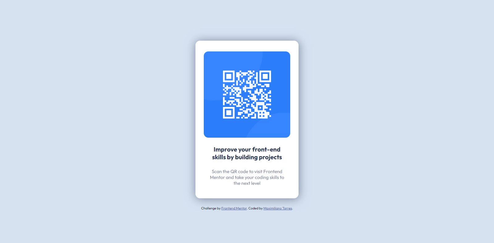

# Frontend Mentor - QR code component solution

This is a solution to the [QR code component challenge on Frontend Mentor](https://www.frontendmentor.io/challenges/qr-code-component-iux_sIO_H). Frontend Mentor challenges help you improve your coding skills by building realistic projects. 

## Table of contents

- [Overview](#overview)
  - [Screenshot](#screenshot)
  - [Links](#links)
- [My process](#my-process)
  - [Built with](#built-with)
  - [What I learned](#what-i-learned)
- [Author](#author)

**Note: Delete this note and update the table of contents based on what sections you keep.**

## Overview

### Screenshot

### Links

- Solution URL: https://gentle-a36b35.netlify.app/

## My process

### Built with

- Semantic HTML5 markup
- CSS custom properties
- Flexbox
- Mobile-first workflow

### What I learned
This time it was an easy challenge, but I can say that it was precisely the first one in which I did not need to check a tutorial to solve it. For the first time I tried the "mobile first" methodology, which I will try to use from now on in future projects. Also for the first time use variables for the CSS. I also learned better how the "display:block" property works to edit some elements such as images and apply a "border-radius" without the need to use "overflow: hidden", which for some reason cut off the bottom part of the image (probably because i don't know how to apply it correctly, but for this case I think that using display: block on the image works perfectly)

## Author

- Frontend Mentor -(https://www.frontendmentor.io/profile/MaxiTRR)
